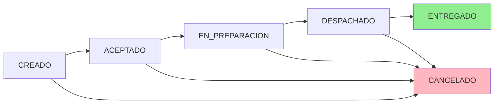

# 📋 Endpoints Completos - Pedidos360

Todos los microservicios según especificación del caso PDF.

---

## 🛒 ORDERS (ms-pedidos360-orders) - Puerto 8081

**Base URL:** `http://54.147.147.166:8081`

### Crear Pedido
```http
POST /api/orders
Content-Type: application/json

{
  "customerId": "12345",
  "customerName": "Juan Pérez",
  "customerEmail": "juan@example.com",
  "deliveryAddress": "Av. Providencia 123",
  "items": [
    {
      "productId": 1,
      "productName": "Café Latte",
      "quantity": 2,
      "price": 3500.0
    }
  ],
  "notes": "Entregar en recepción"
}
```

### Obtener Pedido
```http
GET /api/orders/{id}
GET /api/orders?status=CREADO
GET /api/orders?from=2024-01-01T00:00:00&to=2024-12-31T23:59:59
GET /api/orders?customerId=12345
```

### Cambiar Estado del Pedido
```http
PUT /api/orders/{id}/status
Content-Type: application/json

{
  "status": "ACEPTADO",
  "updatedBy": "operador@pedidos360.cl",
  "notes": "Pedido aceptado"
}
```

**Estados válidos:**
- CREADO → ACEPTADO → EN_PREPARACION → DESPACHADO → ENTREGADO
- CANCELADO (desde cualquier estado excepto ENTREGADO)

### Cancelar Pedido
```http
DELETE /api/orders/{id}?reason=Cliente solicitó cancelación
```

### Estadísticas
```http
GET /api/orders/stats
```

---

## 📦 CATALOG (ms-pedidos360-catalog) - Puerto 8084

**Base URL:** `http://54.147.147.166:8084`

### CRUD Productos
```http
GET    /api/products              # Listar todos
GET    /api/products/{id}         # Obtener por ID
GET    /api/products/category/{category}
GET    /api/products/active       # Solo activos
POST   /api/products              # Crear
PUT    /api/products/{id}         # Actualizar
DELETE /api/products/{id}         # Eliminar
```

### Actualizar Stock
```http
PATCH /api/products/{id}/stock
Content-Type: application/json

{
  "quantity": 10,
  "operation": "DECREMENT"  // o "INCREMENT"
}
```

**Request Body - Crear/Actualizar:**
```json
{
  "name": "Café Latte Grande",
  "description": "Café con leche 16oz",
  "price": 3500.0,
  "stock": 50,
  "category": "Bebidas Calientes",
  "active": true
}
```

---

## 📊 REPORT (ms-pedidos360-report) - Puerto 8085

**Base URL:** `http://54.147.147.166:8085`

### KPIs Principales
```http
GET /api/report/kpis?range=last24h
```

**Rangos válidos:** `last24h`, `last7d`, `last30d`, `today`, `yesterday`

### Top Productos
```http
GET /api/report/top-products?range=last7d&limit=10
```

### Ventas por Hora
```http
GET /api/report/sales-by-hour?date=today
```

### Lead Time
```http
GET /api/report/lead-time?range=last7d
```

### Pedidos Activos
```http
GET /api/report/active-orders
```

### Ingresos
```http
GET /api/report/revenue?range=last30d
```

---

## 🔍 AUDIT (ms-pedidos360-audit) - Puerto 8083

**Base URL:** `http://54.147.147.166:8083`

### Timeline de Eventos (READ-ONLY)
```http
GET /api/audit                    # Todos los eventos
GET /api/audit/{id}               # Evento específico
GET /api/audit/user/{userId}      # Por usuario
GET /api/audit/action/{action}    # Por acción
GET /api/audit/entity/{entity}    # Por entidad
GET /api/audit/order/{orderId}    # Timeline de pedido
GET /api/audit/recent?limit=50    # Más recientes
```

### Filtros Avanzados
```http
GET /api/audit?userId=admin&from=2024-01-01T00:00:00&to=2024-12-31T23:59:59
GET /api/audit?action=ORDER_CREATED&entity=Order
```

### Registrar Evento (Interno)
```http
POST /api/audit
Content-Type: application/json

{
  "userId": "operador@pedidos360.cl",
  "action": "ORDER_CREATED",
  "entity": "Order",
  "details": "Pedido #123 creado",
  "ipAddress": "10.0.0.1"
}
```

---

## 📧 NOTIFY (ms-pedidos360-notify) - Puerto 8086

**Base URL:** `http://54.147.147.166:8086`

**Nota:** Principalmente consumidor de RabbitMQ. Estos endpoints son para testing.

### Consultar Notificaciones
```http
GET /api/notifications              # Todas
GET /api/notifications/{id}         # Por ID
GET /api/notifications/recipient/{email}
GET /api/notifications/channel/{channel}
GET /api/notifications/stats        # Estadísticas
```

### Enviar Notificaciones (Testing)
```http
POST /api/notifications/send
Content-Type: application/json

{
  "recipient": "cliente@example.com",
  "channel": "EMAIL",
  "subject": "Pedido Confirmado",
  "message": "Tu pedido #123 ha sido confirmado"
}
```

### Email Específico
```http
POST /api/notifications/email
Content-Type: application/json

{
  "to": "cliente@example.com",
  "subject": "Estado del Pedido",
  "body": "Tu pedido está en preparación"
}
```

### WebPush
```http
POST /api/notifications/webpush
Content-Type: application/json

{
  "userId": "user123",
  "title": "Pedido Despachado",
  "message": "Tu pedido va en camino"
}
```

---

## 🔐 BFF (Backend For Frontend) - Puerto 8080

**Base URL:** `http://54.147.147.166:8080`

El BFF expone **todos los endpoints anteriores** bajo el mismo path:

```
/api/orders/*        → Delega a Orders (8081)
/api/products/*      → Delega a Catalog (8084)
/api/report/*        → Delega a Report (8085)
/api/audit/*         → Delega a Audit (8083)
/api/notifications/* → Delega a Notify (8086)
```

**Ventajas:**
- ✅ Punto de entrada único
- ✅ Validación JWT Azure AD
- ✅ Circuit Breaker (tolerancia a fallos)
- ✅ CORS configurado
- ✅ Logs centralizados

### Health Check
```http
GET /actuator/health
```

---

## 🔄 Estados del Pedido (Flujo Completo)



**Reglas:**
- ❌ No se puede "despachar" sin "aceptar"
- ❌ Estados ENTREGADO y CANCELADO son finales
- ✅ Stock se decrementa al ACEPTAR pedido
- ✅ Notificaciones se envían en cada cambio de estado

---

## 📝 Ejemplos de Uso Completo

### 1. Crear y Procesar un Pedido

```bash
# 1. Crear pedido
curl -X POST http://54.147.147.166:8080/api/orders \
  -H "Content-Type: application/json" \
  -d '{
    "customerId": "12345",
    "customerName": "Juan Pérez",
    "customerEmail": "juan@example.com",
    "deliveryAddress": "Av. Providencia 123",
    "items": [
      {
        "productId": 1,
        "productName": "Café Latte",
        "quantity": 2,
        "price": 3500.0
      }
    ]
  }'

# 2. Aceptar pedido (decrementar stock)
curl -X PUT http://54.147.147.166:8080/api/orders/1/status \
  -H "Content-Type: application/json" \
  -d '{
    "status": "ACEPTADO",
    "updatedBy": "operador@pedidos360.cl"
  }'

# 3. Preparar pedido
curl -X PUT http://54.147.147.166:8080/api/orders/1/status \
  -H "Content-Type: application/json" \
  -d '{
    "status": "EN_PREPARACION",
    "updatedBy": "cocina@pedidos360.cl"
  }'

# 4. Despachar pedido
curl -X PUT http://54.147.147.166:8080/api/orders/1/status \
  -H "Content-Type: application/json" \
  -d '{
    "status": "DESPACHADO",
    "updatedBy": "delivery@pedidos360.cl"
  }'

# 5. Entregar pedido
curl -X PUT http://54.147.147.166:8080/api/orders/1/status \
  -H "Content-Type: application/json" \
  -d '{
    "status": "ENTREGADO",
    "updatedBy": "delivery@pedidos360.cl"
  }'
```

### 2. Ver Timeline de Auditoría

```bash
# Ver todos los eventos del pedido #1
curl http://54.147.147.166:8080/api/audit/order/1
```

### 3. Ver KPIs y Reportes

```bash
# KPIs últimas 24 horas
curl http://54.147.147.166:8080/api/report/kpis?range=last24h

# Top 10 productos
curl http://54.147.147.166:8080/api/report/top-products?range=last7d&limit=10

# Lead time promedio
curl http://54.147.147.166:8080/api/report/lead-time?range=last7d
```

---

## ✅ Checklist de Funcionalidades

### Orders
- [x] POST /api/orders (crear)
- [x] GET /api/orders/{id}
- [x] PUT /api/orders/{id}/status
- [x] GET /api/orders (filtros: status, from, to, customerId)
- [x] DELETE /api/orders/{id} (cancelar)
- [x] GET /api/orders/stats
- [x] Validación de flujo de estados
- [x] Cálculo automático de totales

### Catalog
- [x] CRUD completo de productos
- [x] PATCH /api/products/{id}/stock
- [x] Filtros por categoría y estado activo

### Report
- [x] GET /api/report/kpis
- [x] GET /api/report/top-products
- [x] GET /api/report/sales-by-hour
- [x] GET /api/report/lead-time
- [x] GET /api/report/active-orders
- [x] GET /api/report/revenue

### Audit
- [x] GET /api/audit (con múltiples filtros)
- [x] GET /api/audit/order/{orderId}
- [x] GET /api/audit/recent
- [x] Timeline por usuario/acción/entidad
- [x] Filtros por rango de fechas

### Notify
- [x] GET /api/notifications (consultas)
- [x] POST /api/notifications/send
- [x] POST /api/notifications/email
- [x] POST /api/notifications/webpush
- [x] GET /api/notifications/stats

### BFF
- [x] Delegación a todos los microservicios
- [x] Circuit Breaker
- [x] Validación JWT Azure AD
- [x] CORS configurado
- [x] Health checks

---

## 🚀 Próximos Pasos (Integración Futura)

- [ ] Publicar eventos OrderCreated a Kafka
- [ ] Consumir eventos en Audit desde Kafka
- [ ] Consumir eventos en Report desde Kafka
- [ ] Enviar notificaciones a RabbitMQ al cambiar estado
- [ ] Consumir notificaciones desde RabbitMQ en Notify
- [ ] Decrementar stock en Catalog al ACEPTAR pedido
- [ ] DLQ (Dead Letter Queues) para mensajes fallidos
- [ ] AWS API Gateway con JWT Authorizer

---

**Última actualización:** 2025-01-06  
**Autor:** Bastián Martínez  
**Proyecto:** Pedidos360 - DSY1107 Cloud Native I
